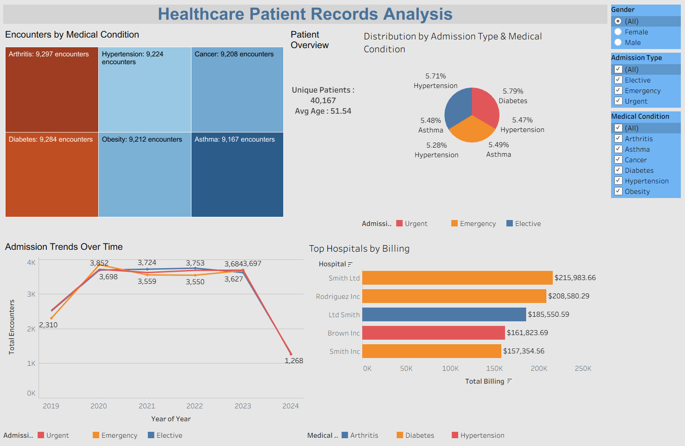
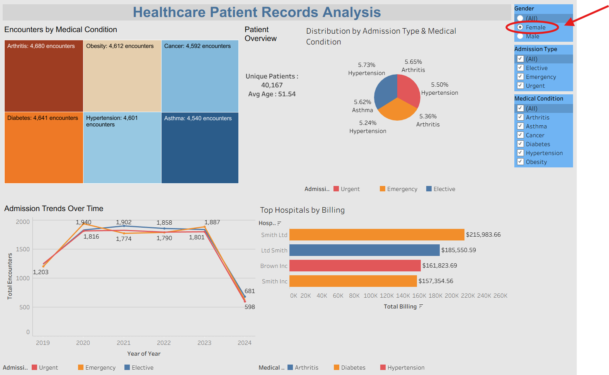

# Healthcare Patient Records Analysis

A portfolio project analyzing 55,392 healthcare encounters using SQL for data processing and Tableau for interactive visualization.

## Dataset
- **Source**: [Healthcare Dataset (Kaggle)](https://www.kaggle.com/datasets/prasad22/healthcare-dataset)
- **Rows**: 55,392 (after cleaning negative billing amounts)
- **Columns**: Patient_Name, Age, Gender, Medical_Condition, Billing_Amount, Admission_Type, etc.

## SQL Analysis
Processed data in MySQL with 6 queries:
1. **KPI Metrics** (`kpi_metrics.csv`): 40,167 unique patients, average age 51.54.
2. **Condition Breakdown** (`condition_gender_admission.csv`): Encounters and average billing by Medical_Condition, Gender, Admission_Type (e.g. Diabetes/Male/Urgent: 1,634 encounters).
3. **Admission Trends** (`admissions_over_time.csv`): Encounters by year/month, Gender, Admission_Type (366 rows).
4. **High-Cost Encounters** (`high_cost_encounters.csv`): Encounters with above-average billing, grouped by Gender, Admission_Type, Medical_Condition.
5. **Top Hospitals** (`top_hospitals_billing.csv`): Top 5 hospitals by billing for patients above average age (e.g. Smith Ltd, $215,983.66).
6. **Repeat Encounters** (`repeat_encounters.csv`): Patients with multiple encounters for the same condition (2,531 rows, using self-join).

Files: [healthcare_analysis.sql](healthcare_sql_script.sql), [CSVs](.)

## Tableau Dashboard
Interactive dashboard with data blending on Gender, Admission_Type, Medical_Condition:
- **KPI Card**: Unique patients and average age.
- **Treemap**: Encounters by Medical_Condition (size/color by Total_Encounters).
- **Line Chart**: Admission trends over time by Year, colored by Admission_Type.
- **Pie Chart**: Distribution of high-cost encounters by Admission_Type and Medical_Condition.
- **Bar Chart**: Top hospitals by billing, colored by Medical_Condition.
- **Filters**: Gender, Admission_Type, Medical_Condition for interactivity.

[View Dashboard on Tableau Public](https://public.tableau.com/app/profile/vishal.d.silva/viz/Healthcare_Dashboard_17612794469780/Dashboard1)

## Skills Demonstrated
- **SQL**: Data cleaning, aggregations, subqueries, self-joins.
- **Tableau**: Data blending, interactive filters, visualizations (treemap, line, pie, bar).

## Screenshots

